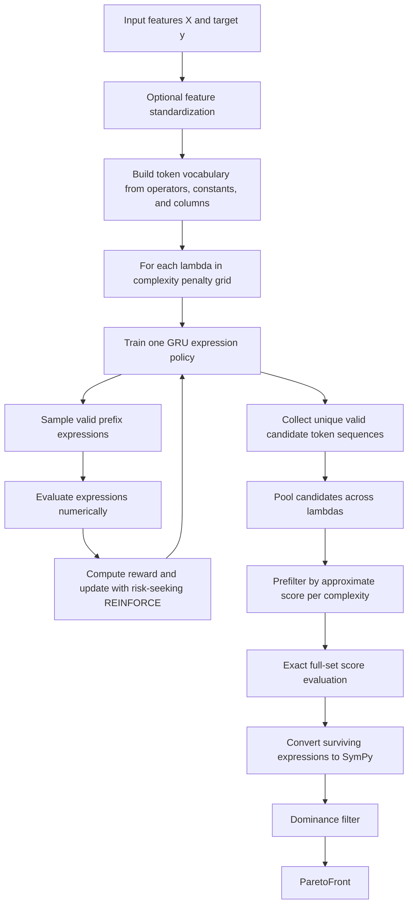
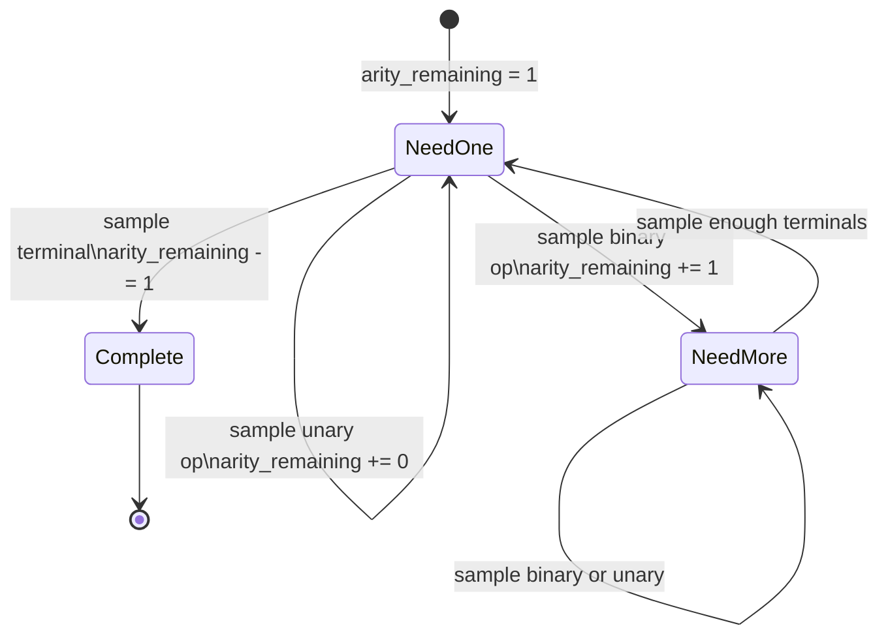
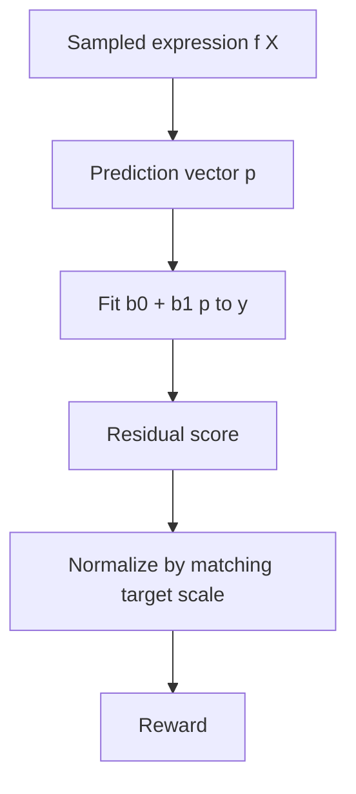
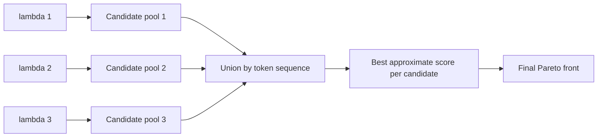
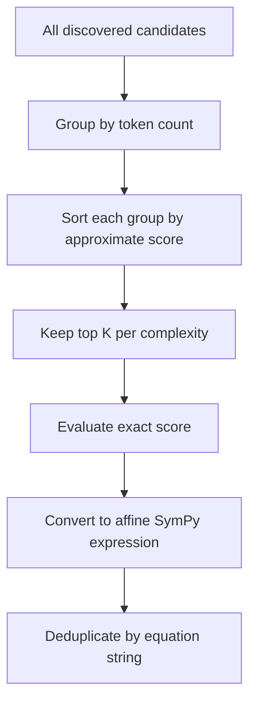
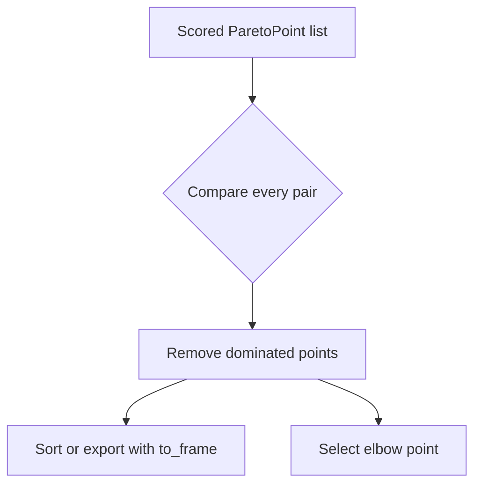
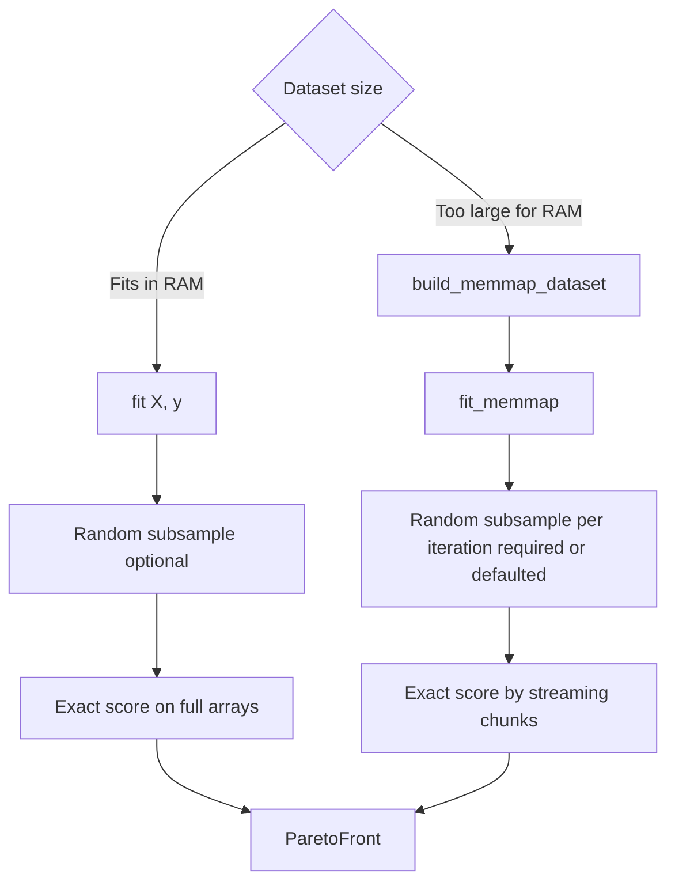
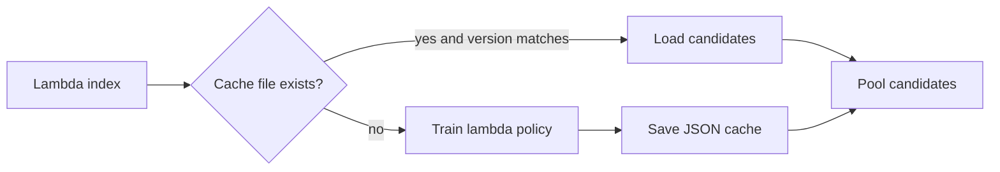

# nsr-engine Methodology

`nsr-engine` searches for closed-form formulas by combining a neural sequence
policy with symbolic expression evaluation. A GRU policy samples valid prefix
expressions, a numeric evaluator scores them against data, REINFORCE updates
the policy toward high-reward expressions, and a lambda sweep converts the
single-objective search into a Pareto front over accuracy and complexity.

## High-Level Pipeline



The method is designed to keep training fast: expression scoring uses NumPy
arrays and float32 feature buffers, while SymPy conversion is deferred until
after training and exact evaluation have reduced the candidate set.

## Validation Workflows

The engine itself fits whatever rows are passed to `fit`. The full pipeline CLI
adds optional validation workflows around that fit. By default
(`--validation-mode none`), no rows are held out and the final Pareto front is
fit on the entire dataset.

| Mode | Workflow | Time-order guarantee |
| --- | --- | --- |
| `none` | Fit once on all rows. | Uses all rows, no held-out evaluation. |
| `sequential` | One chronological train/test split. | Past rows train, immediately subsequent rows test. |
| `holdout` | One train/test split, optionally randomized with `--shuffle`. | Ordered unless `--shuffle` is set. |
| `k-fold` | Partition rows into K folds and evaluate each fold once. | Ordered by default; randomized only with `--shuffle`. |
| `expanding-window` | Repeated folds where the training window grows forward through time. | Future rows are never included in a fold's training set. |
| `walk-forward` | Walk-forward validation using the same expanding-window mechanics. | Future rows are never included in a fold's training set. |
| `blocked-time-series` | Adjacent non-overlapping train/validation blocks. | Each validation block immediately follows its training block. |

For K-fold, expanding-window, walk-forward, and blocked time-series validation,
the CLI reports fold RMSE values and their mean, then fits the final reported
Pareto front on the full dataset.

## Expression Representation

Expressions are sampled as prefix, also called Polish notation, token
sequences. For example:

```text
+ a * b 0.5
```

represents:

```text
a + (b * 0.5)
```

The default vocabulary is:

| Token group | Default tokens | Arity |
| --- | --- | --- |
| Binary operators | `+`, `-`, `*`, `/` | 2 |
| Unary operators | `square`, `abs`, `log` | 1 |
| Variables | DataFrame column names | 0 |
| Constants | `-1.0`, `-0.5`, `0.5`, `1.0`, `2.0` | 0 |
| Start sentinel | `<s>` | internal only |

The unary set is configurable. Beyond the three defaults, a broader menu of
operators (`sqrt`, `cbrt`, `exp`, `log10`, `log2`, `sin`, `cos`, `tan`, `sinh`,
`cosh`, `tanh`, `arcsin`, `arccos`, `arctan`, `arcsinh`, `arctanh`, `sigmoid`,
`neg`, `sign`, `cube`, `reciprocal`) can be enabled with `unary_ops=[...]` or
`--unary-ops`. See the
[CLI reference](cli_reference.md#unary-operators) for each operator's numeric
behavior. Arity, vocabulary ordering, and the sampling masks are all derived
from the active operator set, so an enabled operator participates in the
grammar automatically.

Sampling enforces expression validity with an arity budget. The sampler starts
with one required expression slot. Terminals consume one slot, unary operators
consume one slot and create one slot, and binary operators consume one slot and
create two slots. A sequence is complete when the remaining slot count reaches
zero.



The implementation also masks tokens near `max_len` so the remaining token
budget can still close the tree. This prevents incomplete expression trees
from being sampled.

## GRU Policy

The neural policy is a single-layer GRU cell. At each token position, the
previous token id is embedded, the GRU hidden state is advanced, and a linear
projection emits logits over output tokens. The start sentinel is used as the
first input but is not a valid output token.


All expressions in a batch are sampled in parallel. Completed sequences stop
contributing new log probabilities and entropies, but active sequences continue
until they close or reach `max_len`.

## Numeric Evaluation

The training evaluator walks the prefix tokens recursively and produces a
prediction vector. Invalid operations do not crash the run; they produce NaNs
that are removed from scoring.

| Operator | Numeric behavior |
| --- | --- |
| `+`, `-` | Elementwise addition and subtraction. |
| `*` | Elementwise multiplication with non-finite products converted to NaN. |
| `/` | Elementwise division with denominators smaller than `1e-9` treated as NaN. |
| `square` | Elementwise square. |
| `abs` | Elementwise absolute value. |
| `log` | `log(abs(x) + 1e-10)`. |

The table above lists the default unary operators. Opt-in operators follow the
same NaN-safe convention: restricted-domain operators guard their input (for
example `sqrt(abs(x))` and `arcsin(clip(x, -1, 1))`) and overflow-prone
operators convert non-finite results to NaN. The full behavior table is in the
[CLI reference](cli_reference.md#unary-operators).

Candidates need at least two finite aligned prediction and target values to be
scored.

## Scoring Metrics and Affine Reward

By default, the engine does not score a raw expression directly. It first fits
a least-squares affine wrapper:

```text
y_hat = b0 + b1 * expression
```

The affine wrapper is fit by least squares. The residuals from that calibrated
expression are then scored with `score_metric`. Supported metrics are:

| `score_metric` | Meaning | Direction |
| --- | --- | --- |
| `"mse"` | `mean(residual^2)` | Lower is better. |
| `"rmse"` | `sqrt(mean(residual^2))` | Lower is better. |
| `"mae"` | `mean(abs(residual))` | Lower is better. |
| `"mape"` | `100 * mean(abs(residual) / max(abs(y), eps))` | Lower is better. |
| `"mbd"` | `abs(mean(prediction - y))` | Lower is better. |
| `"r2"` | `1 - SSE / SST` | Higher is better. |
| `"adjusted_r2"` | `1 - (1 - r2) * (n - 1) / (n - p - 1)`, with `p=1` for the generated expression | Higher is better. |

For constant targets, R squared returns `1.0` for a perfect fit and `0.0`
otherwise. For MAPE, `eps` is a small denominator guard for zero-valued
targets.

This makes the reward less sensitive to scale and offset, so a structurally
useful expression can be discovered even if it needs linear calibration.



The reward used during training is:

```text
normalized_score = score_loss / target_scale
reward = 1 / (1 + normalized_score) - lambda * complexity
```

For lower-is-better metrics, `score_loss` is the metric value. For `"r2"` and
`"adjusted_r2"`, `score_loss = max(1 - metric_value, 0)` so the reward remains
a minimization-style loss while the reported metric stays an R squared value.

If `affine_reward=False`, the engine scores the raw expression directly with
the selected metric. The default `score_metric` is `"mse"` to preserve the
original behavior.

## Risk-Seeking REINFORCE

For each iteration, the policy samples `batch_size` expressions. Valid
expressions receive rewards and invalid expressions receive a penalty. The
policy update uses only elite samples at or above the `(1 - elite_frac)` reward
quantile. The quantile itself is used as the baseline.

```mermaid
sequenceDiagram
    participant Policy as GRU policy
    participant Eval as Numeric evaluator
    participant Reward as Reward quantile
    participant Opt as Adam optimizer

    Policy->>Eval: Sample batch of expressions
    Eval->>Reward: Score, normalized score, complexity-adjusted reward
    Reward->>Reward: Select elite reward tail
    Reward->>Opt: Advantage times log probability
    Opt->>Policy: Gradient step with entropy bonus
```

The loss combines:

```text
policy_loss = -mean((reward - quantile) * log_prob) over elite samples
entropy_loss = -mean(entropy) over valid samples
loss = policy_loss + entropy_weight * entropy_loss
```

Gradient clipping is applied with a maximum norm of `1.0`.

## Lambda Sweep and Pareto Search

A single reward mixes fit quality and complexity through one lambda value. To
recover alternatives along the accuracy-complexity tradeoff, the engine trains
one independent policy per lambda and pools all discovered expressions.



Lower lambdas penalize complexity less and tend to allow larger expressions.
Higher lambdas penalize complexity more and tend to favor compact formulas.
The default grid is log-spaced from `lambda_min=1e-4` to `lambda_max=1e-1`.

## Candidate Reduction and Exact Evaluation

Training uses approximate rewards, often on row subsamples. Before building the
front, the engine reduces the candidate pool by keeping the lowest approximate
score candidates within each complexity level. The number kept is controlled by
`prefilter_per_complexity`.

After prefiltering, candidates are evaluated exactly on the complete in-memory
training set, or by streaming the requested memmap row range in chunks.



This design keeps exact evaluation focused on candidates that have already
shown promise while preserving diversity across expression sizes.

## Pareto Front Construction

Each surviving expression has two objectives:

| Objective | Direction |
| --- | --- |
| `complexity` | Lower is better. |
| selected score metric | Lower is better, except `"r2"` and `"adjusted_r2"` where higher is better. |

Point A dominates point B when A is no worse in both objectives and strictly
better in at least one. The final front keeps only non-dominated points.



The `elbow()` helper sorts points by complexity and returns the formula with
the largest score drop per added unit of complexity.

## In-Memory Versus Memmap Training



In-memory `fit` materializes feature arrays once and can score each iteration
on all rows unless `step_subsample_size` is set.

Out-of-core `fit_memmap` stores features and the target in a raw float32
memmap. Each training iteration gathers a random row sample, and final scoring
streams contiguous chunks. If `step_subsample_size` is not set for memmap
training, the engine uses `50_000` rows per iteration or the whole training
range if smaller.

## Caching

When `cache_dir` is provided, each lambda run can save discovered candidates as
JSON. A later run with the same cache path and prefix loads those candidates
instead of retraining that lambda.



Cache files are named:

```text
nsr-lambda-000.json
```

or, when `cache_prefix` is set:

```text
<cache_prefix>_nsr-lambda-000.json
```

## Practical Tuning Guidance

| Goal | Parameters to adjust |
| --- | --- |
| Faster exploratory runs | Reduce `n_lambda`, `n_iters`, `batch_size`, or `max_len`. |
| More search coverage | Increase `n_lambda`, `n_iters`, `batch_size`, or `entropy_weight`. |
| Simpler formulas | Increase `lambda_min`, `lambda_max`, or use a custom higher `lambda_grid`. |
| Larger formulas | Increase `max_len` and consider lower lambda values. |
| Lower memory during training | Set `step_subsample_size` or use `fit_memmap`. |
| Better final candidate diversity | Increase `prefilter_per_complexity`. |
| Reproducible experiments | Set `random_state`, cache with `cache_dir`, and keep data ordering fixed. |
